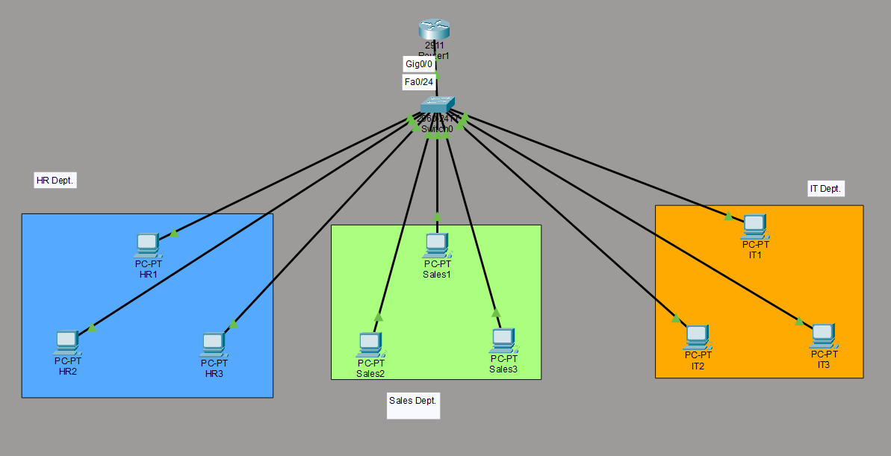

# 🏢 Enterprise Multi-VLAN Network Implementation

## 📌 Project Overview

This project demonstrates the design and implementation of a segmented enterprise LAN using VLAN technology, Inter-VLAN Routing (Router-on-a-Stick), and DHCP services in Cisco Packet Tracer.

The objective was to simulate a real corporate office network environment with multiple departments, centralized routing, and automatic IP management.

---

## 🎯 Project Objectives

- Implement logical network segmentation using VLANs
- Enable communication between VLANs using Router-on-a-Stick
- Configure trunk links using IEEE 802.1Q protocol
- Provide automatic IP address allocation via DHCP
- Perform connectivity testing and basic troubleshooting

---

## 🛠 Network Devices Used

- Cisco 2911 Router
- Cisco 2960 Switch
- 9 End Devices (PCs)

---

## 🏗 Network Design

The enterprise network consists of three departments:

| VLAN ID | Department | Network Address | Default Gateway |
|---------|------------|-----------------|-----------------|
| 10      | HR         | 192.168.10.0/24 | 192.168.10.1    |
| 20      | Sales      | 192.168.20.0/24 | 192.168.20.1    |
| 30      | IT         | 192.168.30.0/24 | 192.168.30.1    |

Each department is logically separated using VLANs to improve security and reduce broadcast traffic.

---

## 🔧 Technical Implementation

### 1️⃣ VLAN Configuration
- Created VLAN 10 (HR)
- Created VLAN 20 (Sales)
- Created VLAN 30 (IT)
- Assigned access ports per department

### 2️⃣ Trunk Configuration
- Configured trunk port between Switch and Router
- Enabled IEEE 802.1Q encapsulation

### 3️⃣ Inter-VLAN Routing
- Implemented Router-on-a-Stick architecture
- Configured sub-interfaces on GigabitEthernet0/0
- Assigned gateway IP addresses for each VLAN

### 4️⃣ DHCP Configuration
- Created separate DHCP pools for each VLAN
- Configured network range and default gateway
- Verified automatic IP assignment

---

## ✅ Verification & Testing

- Successfully assigned IP addresses dynamically
- Verified trunk link using CLI commands
- Tested inter-VLAN connectivity using `ping`
- Observed ARP behavior during first packet transmission
- Performed troubleshooting using:
  - show vlan brief
  - show ip interface brief
  - show interfaces trunk

---

## 📷 Network Topology

---

## 📚 Skills Demonstrated

- VLAN Configuration
- Access & Trunk Port Management
- IEEE 802.1Q Tagging
- Router-on-a-Stick Architecture
- DHCP Server Configuration
- Inter-VLAN Routing
- Network Troubleshooting
- Cisco CLI Operations

---

## 🚀 Key Learning Outcomes

- Understood practical implementation of network segmentation
- Learned trunking and VLAN tagging concepts
- Gained hands-on experience with DHCP and routing
- Developed troubleshooting methodology for enterprise LAN environments

---

## 👨‍💻 Author

Urvish Prajapati  
Aspiring Network Administrator
